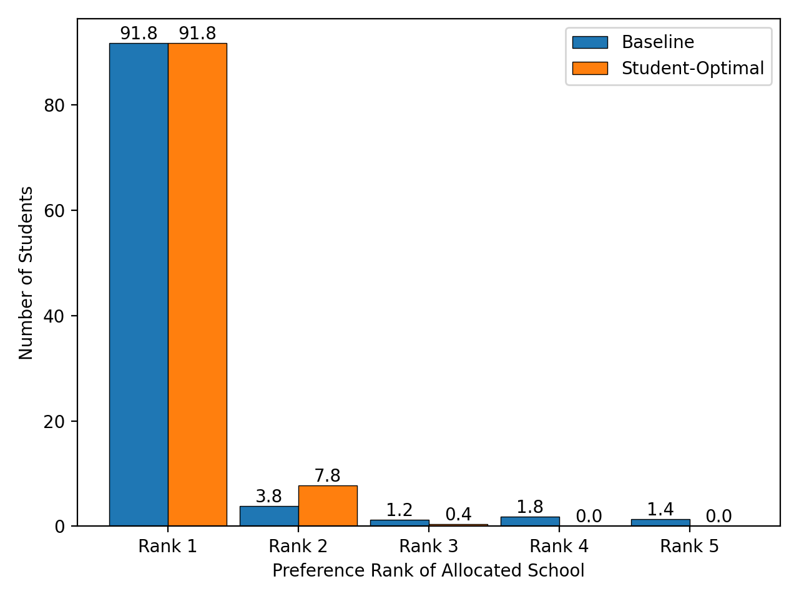
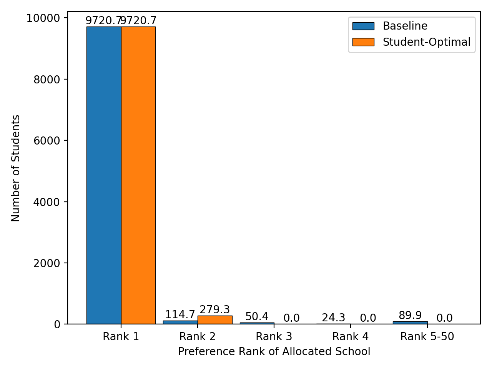

# Stable Marriage with One-Sided Preference Dataset
## Match Quality Comparison: Student-Optimal vs Baseline (Tie-Breaking)
### 100 students, 5 schools

### 1000 students, 5 schools

### 10000 students, 50 schools

## Input Data
- `input/student{n}_school{m}`: n students and m schools
- `student{n}_school{m}_students_seed{k}.csv`: generated preference list of students with seed k
- `student{n}_school{m}_schools.csv`: capacity of each schools

## Output Data
- `output/student{n}_school{m}`: n students and m schools
- `student{n}_school{m}_result_optimal_seed{k}.csv`: student-optimal matching with `students_seed{k}.csv`
- `student{n}_school{m}_result_tb_seed{k}.csv`: student-oriented matching by tie-breaking algorithm with `students_seed{k}.csv`
- `student{n}_school{m}_summary.csv`: utilization and execution time

## Figures
- `figures/student{n}_school{m}`: n students and m schools
- `student{n}_school{m}_utility.png`: figure of qualitative utility with n students and m schools
- `student{n}_school{m}_execution_time.png`: figure of execution time with n students and m schools

